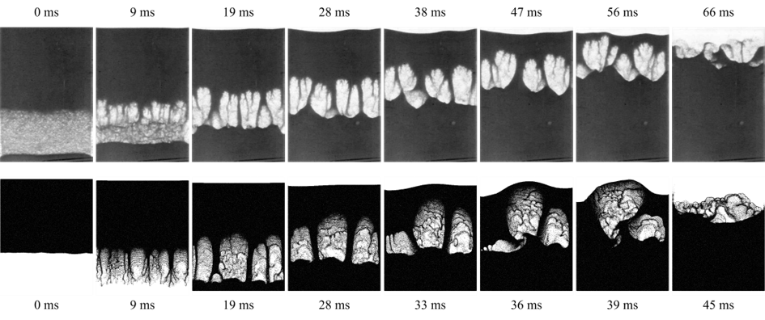

.. _Chap:QB:granRT:

Granular Rayleigh-Taylor
========================

The Rayleigh-Taylor (RT) instability, along with the Kelvin-Helmholtz 
instability, is among the most well-known and fundamental of all multi-phase 
flow instabilities [C81]_. The prototypical case involves two (traditional)
fluids at rest of differing densities with the heavier fluid being accelerated
into the lighter fluid. The instability manifests itself in a deformation of 
the interface between the two fluids. The initial deformation grows into an 
interpenetrating fingering pattern, commonly producing a mushroom cloud 
pattern, before giving way to micro-scale mixing or bubble-droplet formation 
if the fluids are immiscible.

Vinningland and coworkers [VJFTM07]_ devised a granular analogue of the classic 
problem in which the heavier "fluid" is an assembly of particles penetrating 
into a gas, in this case air. The particle assembly is generated by settling 
under gravity into a random close packed array in a Hele-Shaw cell 
(rectangular enclosure) which is quickly inverted around a pivot to bring the 
heavier particle phase above the lighter gas phase. The instability evolution 
is distinct from the classic fluid-fluid RT, which is described by 
Vinningland et al. [VJFTM07]_:

 .. line-block::

    The initially flat front defined by the grains subsequently develops 
    into a pattern of falling granular fingers separated by rising bubbles 
    of air. A transient coarsening of the front is observed right from the 
    start by a finger merging process. The coarsening is later stabilized 
    by new fingers growing from the center of the rising bubbles.

The granular-RT is simulated with MFiX-Exa 19.08 with the following setup. 
The domain is 56 mm wide by 68 mm tall and 1 mm deep which is discretized 
by a uniform mesh of :math:`224 \times 272 \times 4` CFD cells. No-slip walls 
are applied at top, bottom, left and right domain extents. 
The front and back walls are "removed" and treated as periodic in the 
simulation as the depth is only resolved by four CFD cells.
No additional geometry definition is required. 
The particles are assumed monodisperse with a constant diameter of 
:math:`d_p = 140` microns (:math:`dx^* \approx 1.8`) and density of 
:math:`\rho_p = 1050` kg/m\ :sup:`3` \. The resitution and sliding friction 
coefficients are set to 0.9 and 0.25, which are believed to be representative 
of the polystyrene material. The :cpp:`WenYu` drag law of Wen and Yu drag 
[WY66]_ is applied. 1.12M particles are initially randomly distributed 
throughout the domain. The gravity force on the particles is modified by 
:math:`\tanh 100(t - 2)` so that the particles initially settle upwards, 
and then the body force is quickly inverted around :math:`t = 2` s, 
causing the particles to fall downward into the quiescent air. 

   Progression of the granular Rayleigh-Taylor instability in the experiments 
   of Vinningland et al. [VJFTM07]_ (top row) 
   compared to the MFiX-Exa result (bottom row). 

The figure above shows the progression of an MFiX-Exa 19.08 simulation compared 
to the experimental results. There is a good match between the experimental and 
numerical results for roughly the first half of the transien: an initially flat 
interface gives way to many fingers falling into the gas which merge and form 
a semi-stable bubble pattern. However, the simulated bubbles appear to be less
stable than those in the lab, which rise uniformily to the surface. However, in 
the simulations the center bubble rises slighlty faster than the one on the 
left, which shifts more weight over the left-hand bubble, which further impedes 
its rise and eventually "squishes" the left-hand bubble into the center bubble
as it breaks the surface. Later, the right hand bubble also merges with (what 
remains of) the center bubble, allowing a path of least resistance for its air 
to escape without rupturing on the surface on its own. The bubble merging 
significantly accelerates the second half of the transient (notice the 
different times between experiment and simulation). Several different 
variations of this setup were performed: different drag laws, slower inversion 
time, different combinations of particle restitution and friction coefficients, 
inclusion of front and back walls. Although all tests were slighlty different, 
none were able to match the stability of the later time bubble pattern observed 
experimentally.  

