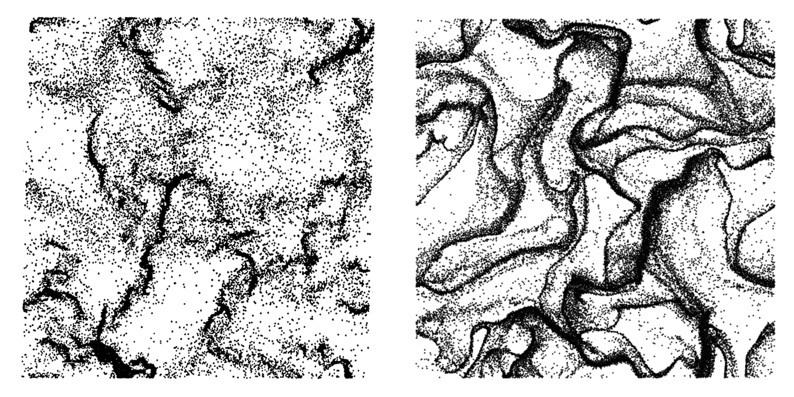

.. _Chap:QB:hcs:

Clustering in the HCS 
======================

The HCS is the simplest non-trivial particulate gas-solid system. The continuum 
gas-phase is initially at rest. The particles are uniformily distributed in space
and have zero momentum in all three directions. However, the particle pecular 
velocity is non-zero, quantified by an initial *granular* temperature, 
:math:`T_0`. The system is periodic in all direcitons and no external forces act 
on the system. Under homogeneous conditions, the granular temperature, :math:`T`, 
is equivalent to two-thirds of the the (massless) mean particle kinetic energy. 
In the HCS, the Eulerian kinetic theory (KT) model of Garzo et al. [GTSH12]_ 
reduces to: 

.. math:: 
   \frac{dT}{dt} = - \frac{2 \gamma}{m} T - \zeta_0 T 

where :math:`m` is the particle mass, :math:`\gamma` is the thermal drag and 
:math:`\zeta_0` is the zeroth-order cooling rate. The first term on the RHS 
above represents viscous dissipation due to the interstitial gas while the 
second term represents collisional dissipation due inelastic particle-particle 
interactions. The ODE has an analytical solution given by Yin et al. [YZMH13]_ 
(also see [LBFHHGS16]_ for the exact model used herein which also includes a
first-order thermal Reynolds number extension to :math:`\gamma`). In the absence 
of clustering, the granular temperature in the HCS decays according to the 
analytical solution, known as Haff's law [H83]_ in granular systems:  
:math:`\gamma = 0`. However, at a critical system size [G05]_, :math:`L^*_c`, 
(where :math:`L^* = L/d_p`), the initially homogeneous state gives way to the 
most fundamental of gas-solid instabilities, the clustering instability, which 
causes :math:`T` (or more accurately :math:`KE`) to deviate significantly from 
KT solution due to regions of high and low concentration and correlated motion. 

To test if MFiX-Exa predicts the expected clustering behavior, a system is set up
with the following non-dimensional parameters:
  
  * initial thermal Reynolds number: :math:`Re_{T_0} = \rho_g d_p \sqrt{T_0} / \mu_g = 20`
  * density ratio: :math:`\rho^* = \rho_p / \rho_g = 1000`
  * restitution coefficient: :math:`e = 0.8`
  * solids concentration: :math:`\phi = \pi N_p / 6 L^*_x L^*_y L^*_z \approx 0.05`

While not specifically studied by Fullmer et al. [FLYH18]_, their results 
indicate that :math:`L_c^*` may be as large as 100 at these conditions. 
In order to avoid the region near critical stability, we use a significnatly
larger system size: :math:`L^*_x = L^*_y = 256`. The system is thin in the 
depth dimension, :math:`L^*_z = 8` in order to highlight the clustering 
phenomena. Therefore, :math:`N_p = 50000`. Because the system is hypothetical, 
the ideal :cpp:`BVK2` DNS drag law is applied, see [BvK07]_, [TPKKv15]_.

.. figure:: figs/hcs_ke_1908.png
   :width: 8cm
   :align: center
   :alt: kinetic energy decay in the HCS

   Decay of the particle mean kinetic energy compared to the KT analytical 
   soluiton of the GTSH model. 

Three replicate systems are simulated with MFiX-Exa 19.08, differing only 
in initial particle locations and pecular velocities. The particle kinetic 
energy is averaged in the simulations (red) and  compared to the analytical 
granular temperature (black) of the HCS as a funciton of time in the figure 
above. The kinetic energy :math:`KE / KE_0` decays by two to three orders of 
magnitude in line with the HCS result until clustering and localized mean 
motion cause a drastic deviation. The final result at :math:`t^* = 1000` 
for one of the replicates is shown below (at right) compared to the seminal 
result of Goldhirsch and Zanetti [GZ93]_ (true 2D), the original demonstration 
of the clustering instability the HCS. 

   Clustered state of the HCS observed by Goldhirsch and Zanetti [GZ93]_
   (left) compared to an MFiX-Exa result (right). 

