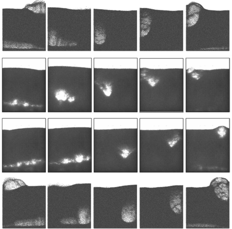

.. _Chap:QB:mehrdad:

Mehrdad's Bed 
=============

Typically, bubbling fluidized beds are produced by uniformily--in space and 
time--driving a gas flow through a particle bed. Slightly different bubbling 
patterns are observed depending largely on the Geldart classification [G73]_ 
of the particles and the size of the bed. Like gas bubbles in a liquid bed, 
the dynamics are almost always highly irregular and chaotic in nature. 
However, by periodically driving the gas flow, chaotic bubbling can be 
suppressed yeilding quasi-regular periodic bubbling [PB98]_. Studying bubble 
control methods, Coppens and coworkers [Cv03]_ realized that periodic bubbling 
produces starkly regular patterns in thin beds, which may be useful for code 
validation [WdLC16]_. Shahnam and coworkers took the problem even further and 
reducing the latteral dimension to produce an oscillating Left-Right single 
bubble pattern in a setup affectionately referred to as *Mehrdad's bed* [S18]_.  

Mehrdad's bed is a rectangular geometry of width :math:`L_x` =  50 mm, 
height :math:`L_y` = 160 mm, and depth :math:`L_z` =   5 mm. The domain is 
resolved by a uniform CFD grid of :math:`80 \times 256 \times 8`. No-slip walls 
are applied on the vertical domain extents with a mass inflow at the bottom and 
a pressure outflow at the top of the domain. The mass inflow is defined in 
`usr1.f90` as: 

.. code:: fortran 
   
  real(rt),   intent(in ) :: time
  real(rt) :: usr_pi, usr_umf

  usr_pi  = 4.0d0*ATAN(1.0d0)
  usr_umf = MIN(0.15d0, 0.1d0*time)

  bc_u_g(1) = usr_umf*(1.3d0 + 0.7d0*DSIN(10.0d0*usr_pi*time))

The bed consists of 188500 particles which are assumed to be monodisperse with 
constant diameter and density of :math:`d_p = 400` microns and 
:math:`\rho_p = 2500` kg/m\ :sup:`3` \, respectively. 

   Comparison of the experiment (middle two rows) to the MFiX-Exa simulation 
   (top and bottom rows).    
   
The bed is simulated using MFiX-Exa 19.08 for an initial transient period of 
10 s before an observation window of an additional 5 s. The desired left-right 
pattern is seen as shown in the figure above. 

