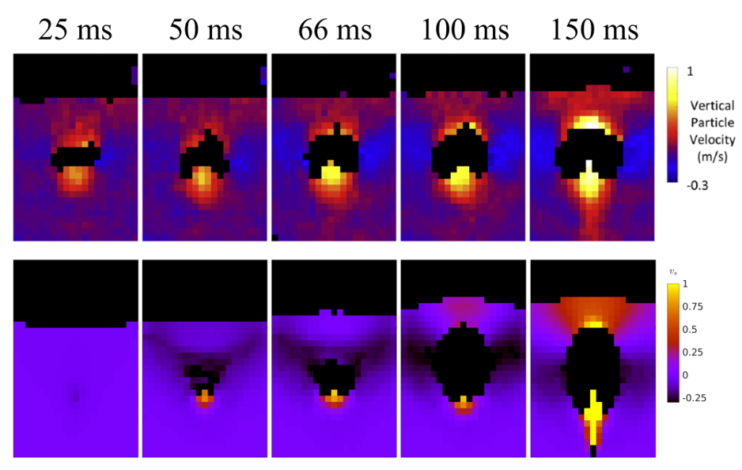

.. _Chap:QB:singbub:

Single Bubble Injection 
=======================

Another variation on bubbling typically observed in bubbling fluidized beds 
is the detailed single-bubble study of Boyce and coworkers [BPLPM19]_. In the 
experiment, a cylinderical bed is brought to incipient fluidization 
(just *under* minimum fluidization) by a uniform disributor. Then, an 
additional volume of gas is abruptly injected from a nozzle located in the 
center of the bed causing a single bubble to form and rise through the bed. 
Measurement of the evolution of the bubble formation, rise and 
is captured with high-speed, high-resolution magnetic resonance imaging (MRI)
in a 10 mm thick slice through the center of the bed. Two particle types 
are studied experimentally, only the larger of which is currently used 
for qualitative benchmarking. 

The experimental test section is a cylinderical bed 190 mm in diameter and 
300 mm tall. The system is modeled in a domain of size 192 mm square by 384 mm 
tall with a cylinderical EB geometry centered at :math:`(x,z) = (96, 96)` mm. 
The modeled bed height is larger than the experimentso that it can be resolved 
by a uniform uniform CFD grid of power 2. Specifically, the applied grid is 
:math:`32 \times 64 \times 32`, such that :math:`dx^* \approx 2.0`. 
:math:`N_p = 260`-thousand particles make up a bed of approximately 
:math:`h_{bed} = 200` static bed height. The particles are of diameter 
:math:`d_p = 2.93` mm and density 
:math:`\rho_p = 1040` kg/m\ :sup:`3` \, respectively. Mass inlet and pressure 
outlet boundary conditions are specified at the bottom and top of the domain, 
respectively. The nozzle is modeled with a secondary mass inlet covering the 
center (in x,z) four CFD cells. We note that, as modeled, the area of the 
injector is roughly three times that of the experimental nozzle, a tube of 
:math:`7.95` mm diameter. The injection times are adjusted slightly to 
:math:`\delta t_{inj} = 154.2`, :math:`101.7`, :math:`66.7`, :math:`51.4`, 
and :math:`25.0` ms so that a uniform jet velocity of :math:`50` m/s can be 
applied in all cases.

A separate defluidization simulation was first carried out first to determine
:math:`U_{mf} \approx 0.66` m/s using the :cpp:`WenYu` [WY66]_ drag law, slightly 
below the experimentally measured value of :math:`U_{mf} = 0.7` m/s. The bed 
was prepared with two initialization simulations. First, the particle initial
condition is fluidized above :math:`U_{mf}` at :math:`0.8` m/s for one second 
using both the uniform distributor and jet sections. Then, the jet section is 
shut off (velocity in BC set to zero) and the flow in the uniform distributor 
section is reduced to incipient fluidization at :math:`0.66` m/s for an 
additional two seconds. Then, beginning at :math:`t = 3` s, the jet region is 
set to :math:`50` m/s for a specified injection duration given previously. 
The jet is switched on and off with a step change in `usr1.f90`. 

   Comparison of experiment and MFiX-Exa simulaton for single bubbles 
   injected into incipiently fluidized beds for increasing (left to right) 
   injection times. 

The figure above provides a comparison between MFiX-Exa `19.08` simulation 
results and the experimental measurements. In both cases, the particle data 
has been averaged onto a :math:`10` mm thick grid of :math:`21 \times 32`
For the longer injection times, :math:`\delta t_{inj} \approx 100` and 
:math:`150` ms, the simulated bubbles are larger and more elongated than 
observed experimentally. However, this trend is not universal, at shorter 
injection times, the bubble is too small and actually collapses before 
erupting at the surface. Above, the bubble produced from a :math:`50` ms 
injection is currently in the process of collapsing. Another interesting 
feature (perhaps most apparent at :math:`66` ms), is the V-shaped region 
of particle down flow centered around the bubble centeroid, which appears 
to be captured rather well by the simulation. 

